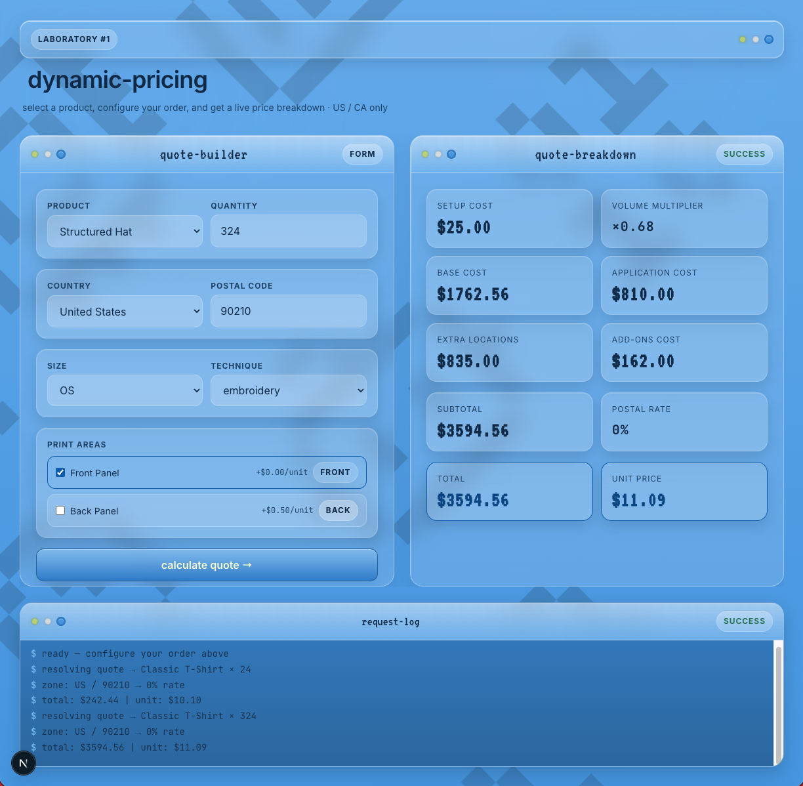

# Dynamic Pricing Quote Demo

A portfolio-grade **Next.js + TypeScript** Laboratory that showcases a backend-driven pricing flow for customizable apparel products.

This project simulates a quote system where the user selects a product, quantity, print areas, and delivery location (**US/CA only**), and receives a reproducible price breakdown calculated on the backend.

The goal of this lab is to demonstrate:
- clean domain modeling
- backend as pricing source of truth
- country-aware postal code validation
- reusable validation architecture
- a structured quote flow from UI to API
- a reusable retro-tech visual system integrated into a real app

## Preview

```md

```

---

## Features

- **Backend-driven quote calculation**
- **Domain-oriented pricing engine**
- **Country-aware postal code validation** for **US** and **CA**
- **Reusable validation design** prepared for future provider-based verification
- **Retro-tech themed UI** with a shared design system
- **Responsive dashboard layout**
- **Request log / console panel**
- **Vitest coverage** for domain logic and request schema validation

---

## Tech Stack

### App
- Next.js (App Router)
- TypeScript
- React
- Tailwind CSS

### Domain / Validation
- Pure domain services
- Zod
- Vitest

### UI / Design System
- Shared local design system package:
  `@wendy/retro-tech-foundation`

---

## Project Goal

This demo was built to recreate a real-world pricing and customization problem in a simplified but defendable way.

It focuses on the kind of engineering decisions needed in production systems:
- separating domain logic from delivery/UI
- keeping pricing logic on the backend
- validating user input both in frontend and backend
- building a reusable architecture that can evolve over time

---

## How It Works

### Quote Flow
1. User selects a product
2. User chooses quantity
3. User selects print areas
4. User enters country and postal code
5. Frontend validates postal code format
6. Backend validates request again
7. Route handler calls the use case
8. Domain services compute the quote
9. UI renders a full price breakdown

### Pricing Inputs
The quote is based on:
- product pricing category
- quantity
- selected print areas
- number of unique print locations
- add-on cost per area
- postal zone rule
- price book version

---

## Pricing Formula

The backend calculates the final quote using a deterministic breakdown.

- `Block1 = setupCost + (quantity × baseCost × volumeMultiplier) + (applicationPerUnit × quantity)`
- `ExtraLocations = (locations - 1) × (setupCost + applicationPerUnit × quantity)`
- `AddOns = addOnPerUnit × quantity`
- `PrePostal = Block1 + ExtraLocations + AddOns`
- `Total = PrePostal × (1 + postalRatePct / 100)`
- `UnitPrice = Total / quantity`

Example response:

```json
{
  "setupCost": 25,
  "baseCost": 1827.8400000000001,
  "volumeMultiplier": 0.68,
  "applicationCost": 560,
  "extraLocationsCost": 585,
  "addOnsCost": 112,
  "postalRatePct": 15,
  "subtotalBeforePostal": 3109.84,
  "total": 3576.316,
  "unitPrice": 15.965696428571428
}
```

---

## Postal Code Validation

This demo supports **US** and **CA** only.

### Accepted formats
- **US**: `12345` or `12345-6789`
- **CA**: `A1A 1A1` or `A1A1A1`

Validation is implemented in a reusable way:

- **Domain layer**: pure format validator
- **Application layer**: validation port/interface
- **Infrastructure layer**: local format-based implementation
- **UI**: instant inline feedback
- **Backend**: request schema validation with Zod

This makes the current version simple, while leaving room for future integration with external postal-code providers.

---

## Architecture

This project uses a lightweight layered architecture:

- `src/core/domain` → entities, value objects, domain services, validation
- `src/core/application` → use cases and ports
- `src/infrastructure` → JSON repositories and validator implementation
- `app/api` → route handlers
- `app/quote` → UI components and user flow

### Domain Model
See the domain diagram here:

[Domain Model](./docs/domain-model.md)

---

## Project Structure

```txt
app/
  api/
    quote/
  quote/
    _components/
src/
  core/
    application/
    domain/
    infrastructure/
  data/
docs/
  domain-model.md
```

---

## API

### `POST /api/quote`

Creates a quote breakdown for a selected product configuration.

### Example payload

```json
{
  "productId": "prod-hoodie-001",
  "quantity": 224,
  "selectedAreas": [
    { "areaId": "front-chest" },
    { "areaId": "back-center" }
  ],
  "location": {
    "country": "CA",
    "postalCode": "M5H 2N2"
  }
}
```

### Success response
Returns a structured quote breakdown with total and unit price.

### Validation errors
Returns `422` with field-level details when request data is invalid.

---

## Running Locally

### Requirements
- Node 20+
- npm

### Install
```bash
npm install
```

### Run development server
```bash
npm run dev
```

### Run tests
```bash
npm test
```

### Build
```bash
npm run build
```

---

## Testing

Current coverage includes:
- domain pricing services
- zone resolution
- volume tier resolution
- postal code validation
- request schema validation for quote route

Planned:
- end-to-end tests for the quote flow

---

## Design Notes

The UI uses a custom retro-tech visual foundation inspired by classic Macintosh interfaces and early desktop software aesthetics.

This was intentionally built as a reusable design system so the same visual language can later be shared across:
- Next.js demos
- Vue demos
- Ionic/mobile demos

---

## Roadmap

Possible next improvements:
- provider-based postal code verification
- cart/session layer
- checkout simulation
- area preview interactions
- end-to-end tests
- richer request/response logging
- deployment polish

---

## Why This Project Exists

This project is part of a broader portfolio effort to translate real product engineering experience into public, explainable, and defendable code samples.

It is meant to demonstrate how I think about:
- domain logic
- frontend/backend integration
- validation
- maintainability
- technical communication through code structure and documentation