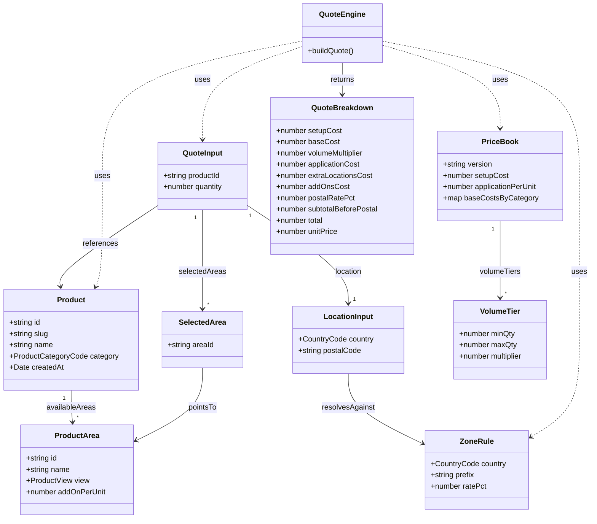

# Domain Model

```mermaid
classDiagram
  class Product {
    +string id
    +string slug
    +string name
    +ProductCategoryCode category
    +Date createdAt
  }

  class ProductArea {
    +string id
    +string name
    +ProductView view
    +number addOnPerUnit
  }

  class QuoteInput {
    +string productId
    +number quantity
  }

  class SelectedArea {
    +string areaId
  }

  class LocationInput {
    +CountryCode country
    +string postalCode
  }

  class PriceBook {
    +string version
    +number setupCost
    +number applicationPerUnit
    +map baseCostsByCategory
  }

  class VolumeTier {
    +number minQty
    +number maxQty
    +number multiplier
  }

  class ZoneRule {
    +CountryCode country
    +string prefix
    +number ratePct
  }

  class QuoteBreakdown {
    +number setupCost
    +number baseCost
    +number volumeMultiplier
    +number applicationCost
    +number extraLocationsCost
    +number addOnsCost
    +number postalRatePct
    +number subtotalBeforePostal
    +number total
    +number unitPrice
  }

  class QuoteEngine {
    +buildQuote()
  }

  Product "1" --> "*" ProductArea : availableAreas
  QuoteInput "1" --> "*" SelectedArea : selectedAreas
  QuoteInput "1" --> "1" LocationInput : location
  PriceBook "1" --> "*" VolumeTier : volumeTiers
  LocationInput --> ZoneRule : resolvesAgainst
  QuoteInput --> Product : references
  SelectedArea --> ProductArea : pointsTo

  QuoteEngine ..> QuoteInput : uses
  QuoteEngine ..> Product : uses
  QuoteEngine ..> PriceBook : uses
  QuoteEngine ..> ZoneRule : uses
  QuoteEngine --> QuoteBreakdown : returns
```